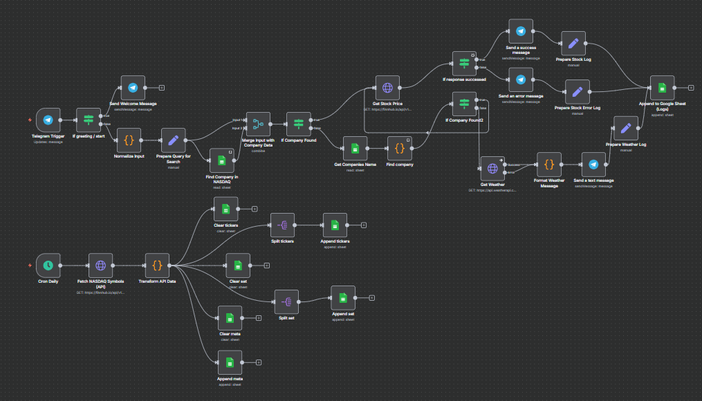
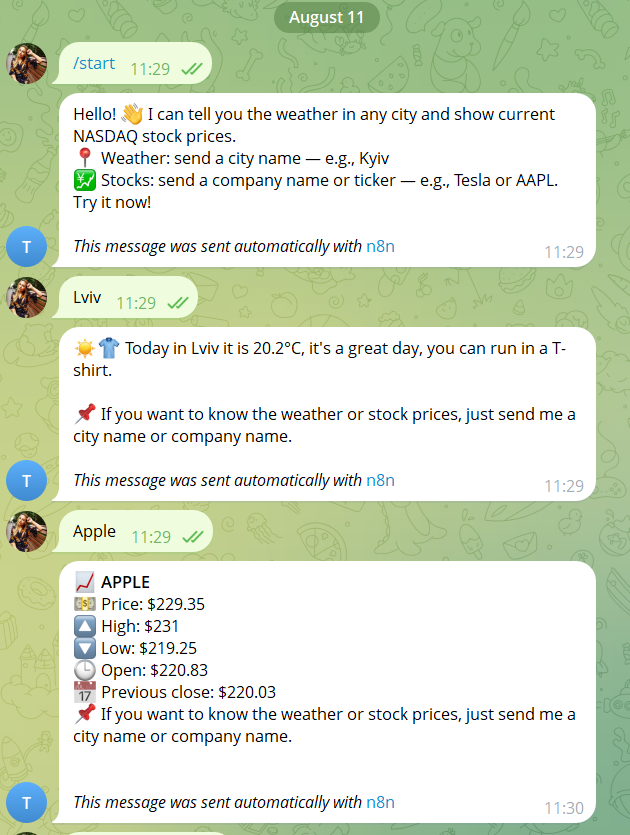
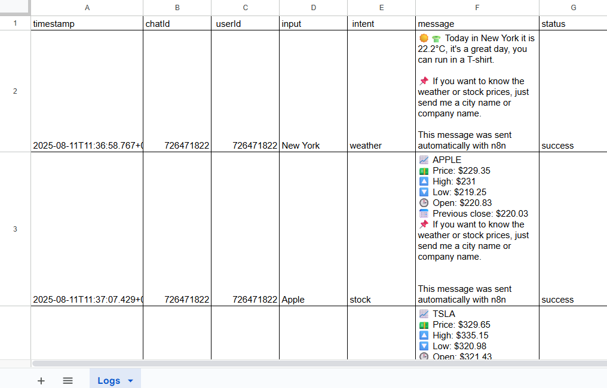
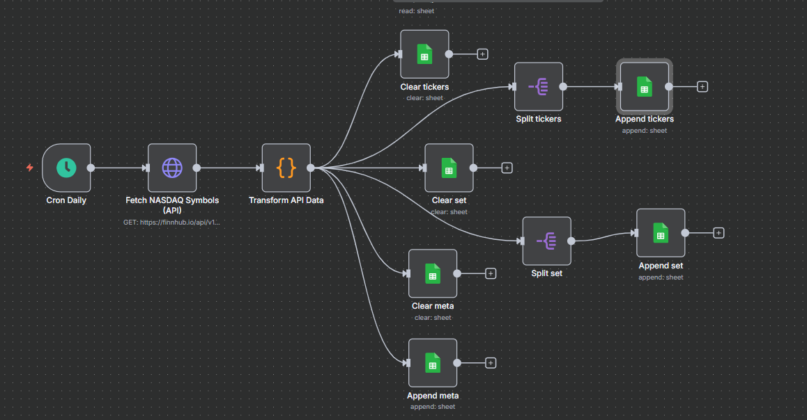

# 🤖 Telegram Bot: Weather & NASDAQ Stocks  

This project is an **intelligent Telegram bot** built with **n8n** that provides two main features:  

1. **🌦️ Weather Forecasts**  
   - Send any city name.  
   - Get real-time weather updates with friendly recommendations (e.g., wear a jacket).  
 

2. **💹 NASDAQ Stock Prices**  
   - Send a company name or ticker symbol.  
   - The bot searches in the NASDAQ dataset and returns live stock prices.  
   - Resilient to case sensitivity, spelling variations, and partial matches.  

---

## ✨ Features  

- 🧠 **Smart logic** – distinguishes between cities (weather) and companies (stocks).  
- 🚫 **Stop-word filtering** – avoids false matches (e.g., *New York Mortgage Trust*).  
- 🎨 **User-friendly messages** – formatted with icons and clear structure.  
- 📊 **Google Sheets integration** – all queries and responses are logged.  
- ⚡ **Scalable workflow** – modular design in n8n for easy extension.
- **Scalability** – additional scheduled workflow keeps dataset up to date.   

---

## ⚙️ Main Workflow  

1. **Telegram Trigger** – receives user input.  
2. **Normalization** – uppercase conversion, trimming, typo handling.  
3. **Company Search** – checks against NASDAQ dataset.  
   - ✅ Match → stock price branch.  
   - ❌ No match → weather branch.  
4. **Weather Lookup** – fetches forecast via external API.  
5. **Message Formatting** – adds emojis, icons, and context-aware text.  
6. **Response Delivery** – sends back to Telegram.  
7. **Logging** – appends query & response into Google Sheets.  

### Additional Workflows  
- **📅 Cron-based Updater**  
  - A scheduled workflow (using Cron Trigger in n8n).  
  - Periodically fetches the full list of NASDAQ companies via API.  
  - Updates Google Sheets with tickers and company names.  
  - Ensures the bot always has fresh data for accurate company matching.  
---

## 📸 Screenshots  

### Main Workflow  
  

### Example – Bot Response  
  

### Google Sheet Logs
  

### Cron Workflow (NASDAQ Updater)  
  

---

👉 With this bot, users can instantly get **up-to-date stock prices** or **real-time weather forecasts** by simply typing a single word in Telegram.  

---

